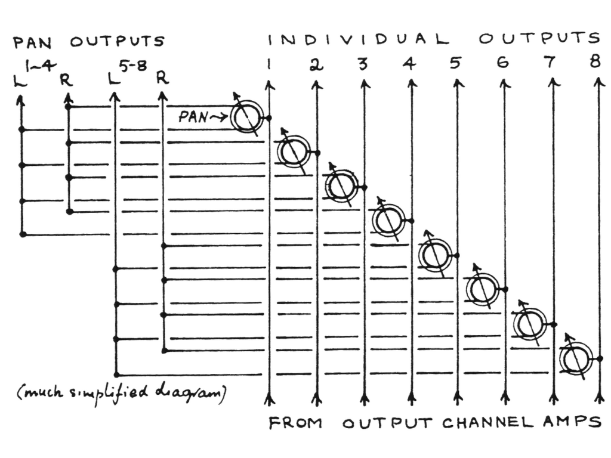

# Introduction

*Aquí irá el contenido migrado de `TeX_files/section_1.tex`*

## Ejemplo de figura

## Ejemplo de advertencia

::: warning
Este es un ejemplo de advertencia que se convertirá en una caja coloreada en el PDF.
:::

## Ejemplo de nota

::: note
Esta es una nota informativa.
:::
