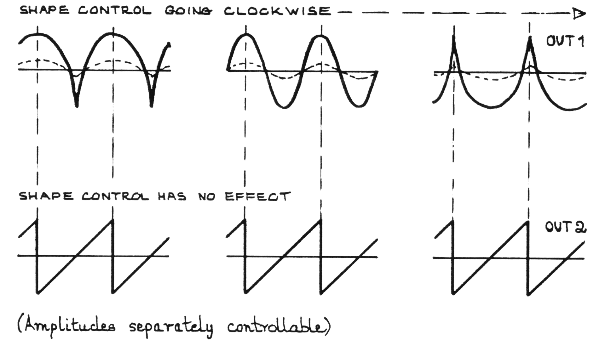

# Analog Signal Devices

**Signal Source**

- Audio Oscillators
- Sub-audio Oscillators (1)
- Input Amplifiers
- White Noise Generators

Of the twelve oscillators in the S.100 (apart from the eight Filter/Oscillators), nine are intended largely as audio sources, and three as control sources. But since all outputs are directly coupled (able to pass DC) these roles can be reversed, and it is largely a matter of the frequencies required. Simply switch to high/low range as required. The nine 'audio' oscillators divide into two types, but all have the same frequency range. All have a control voltage slope of 1V per octave. All can be locked by synchronising inputs, which ensures perfect tracking of unisons, octaves, fifths or any other simple ratio partial.

## Oscillators 1 – 12

**Output 1**: Sine + Sawtooth (with sine ShapeControl to give variable amounts of even harmonic distortion)

**Output 2**: Sawtooth Ramp + Pulse, with Pulse mark–sweep variable.

These 12 identical oscillators have two in-phase outputs with shapes and phase relationship as shown in the figure below. Find these outputs on the Signal Board and the control inputs on the Control Board.

{#fig:figure_3_shape_control}

With the small synthesizers, the amount of timbre control possible without using filters is limited by the fact that two oscillators can never be tuned so that they are locked in phase, and beats will always occur. Try now putting Oscs. 1 and 2 sines to output, and Osc. 1 ramp to synch. input 2. For the moment keep Osc. 1 ramp level at zero, and tune the two oscillators an octave apart, Osc. 2 being the higher. Monitor both on $Y_{1}$ (two pins); however carefully you tune, the picture will slowly drift as the relative phase changes, and slow beats will occur. Now bring up the ramp output of Osc. 1; at a certain point the waveform (and the sound) will lock, and there will be the illusion of one sound source instead of two (particularly if Osc. 2 sine level is set somewhat lower than Osc. 1, to simulate a 'natural' second harmonic). This facility enables timbres to be constructed additively, by adding sines to build the desired harmonic structure. There is no reason why you cannot use ramps as well, but the harmonic structure is more difficult to predict (but see below).

The main thing to remember when using synch. inputs is that they cannot lock unless they are near to a simple frequency ratio (2:1 in the above example, but 1:1, 3:1, 8:1 etc). If you are way off tune the oscillator being controlled will give an unstable output. Try this by moving Osc. 2 frequency slowly. As soon as it is far enough off for Osc. 1 to be unable to lock the octave, it will switch rapidly from one frequency to another (a complicated function of both the frequency and amplitude of the synch. input). As soon as it finds the next simple ratio it will lock again (the fourth below the octave or the fifth above, etc). So you can synchronise a whole harmonic series, within reason.

For a more complete study, tune all six oscillators as follows: _first put in control pins_ from some suitable control source. Unless you do this before tuning you will have to do it all again. For this experiment take a joystick output, which will enable us to track our constructed timbre through several octaves (a static timbre at this stage, of course, with no internal variations or envelope). Put white (100K) pins at C11+26, 27, 28, 29, 30, 31. Set lefthand joystick (q.v.) vertical range control to give about 3–4 octaves when the stick is moved up and down, and leave stick towards the low pitch end (towards you). Tune Osc. 1 to a low note, put all six sines to one output, and insert a synch. pin from Osc. 1 ramp to Osc. 2 synch. input. Follow the series shown in Fig. 4(a) — i.e., tune Osc. 2 to the octave above, setting the frequency control in the centre of 'locked' area, and the ramp output at or near maximum. Continue to put in synch. pins after tuning each oscillator as near as possible to successive harmonics, then check them. Tune slave oscillators on low side if anything, as synchronisation tends to raise frequency.

When you get to Oscs. 5 and 6, you may choose various configurations from harmonics 5–10 or higher (or you can miss out one or two of the lower harmonics and use more higher ones). Locking the higher harmonics becomes more difficult as they are much closer together and the ratios larger. Now adjust sine levels so that the fundamental is loudest and progressively reduce the level of each harmonic (this for a start — you can alter the timbre a great deal by changing internal amplitudes). Try moving the joystick. Some of the oscillators may go out of lock at some point. Readjust for best holding. It is asking a great deal to expect synchronisation of, say, the 7th harmonic for five octaves or more, but it should be possible over at least four octaves. It is also worth trying different synch. pin arrangements. For example, State 2 on Specimen Patch 1 locks Oscs. 2 and 3 from 1, but 4 and 5 from 2 (the octave of 1), and 6 from 4 (the double octave). This may work better, but you have to try different arrangements. Sometimes a double–locked arrangement is best, with mutual synch. pins between oscillators. Note that the synch. input is driven from output you are not using for signal — otherwise you could not reduce the signal level for the sound you want without losing the synch. input level.

Look at Fig. 4(b). This shows an alternative timbre structure using a sawtooth output on the second harmonic (change synch. also if you are using State 2). The waveform itself now contributes to the timbre (coming up on even harmonics of the fundamental), and the sound will be richer, but buzzy at the top. Remove some of the upper harmonics by putting the whole complex through the Eight Octave Filter Bank (q.v.). Set all the lower controls of the Filter Bank at No. 10, and slope off to 0 at the highest octave.

This method of timbre construction can give extremely rich organ-like tones, and you can experiment with emphasising certain harmonics. You can also, of course, try different series altogether, but you will not achieve lock unless the relationships are fairly simple.
